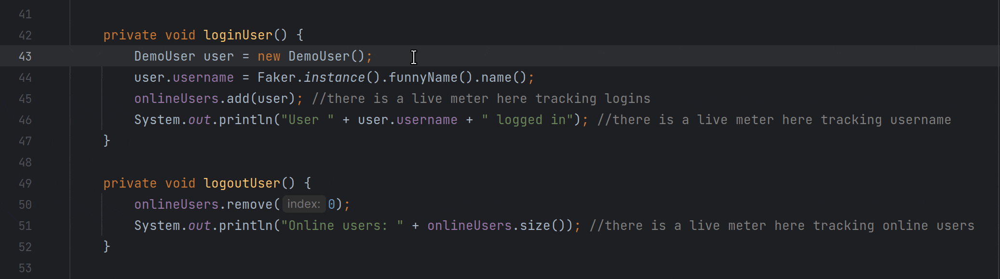

# Show/Hide Meters

The *Show/Hide Meters* command allows you to show and hide the live meters throughout your application. As live meters
only exist at runtime and do not require code changes, this command makes it easy to quickly hide meters when you don't
need them and show them again if you do.

## Available Contexts

- The *Show Meters* command is available on any files with live meters that are currently hidden.
- The *Hide Meters* command is available on any files with live meters that are currently visible.

## Parameters

- None

## Demonstration

