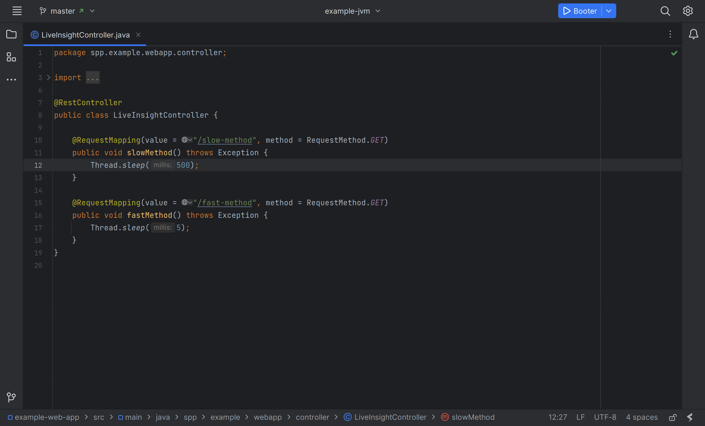

# Function Duration Insight

The **Function Duration** insight predicts the expected duration of a function invocation in production based on the sum
of the durations of the various operations within the function that have been recorded in production.

## How It Works

- Uses the `endpoint_resp_time` metric to calculate the expected duration of a function invocation in production.
- Uses static control-flow & data-flow analysis to simplify the function's execution graph.
- Sums the durations of the various operations within the function that have been recorded in production.
- Averages the sum of the unique paths through the function's execution graph.

## Supported Operations

- Function calls - function duration ([source](https://github.com/sourceplusplus/interface-jetbrains/blob/master/insight/src/main/kotlin/spp/jetbrains/insight/pass/artifact/CallDurationPass.kt))
- Literal branching - control flow probability ([source](https://github.com/sourceplusplus/interface-jetbrains/blob/master/insight/src/main/kotlin/spp/jetbrains/insight/pass/multipath/StaticDfaMultiPathPass.kt))
- Java counting loops - function duration ([source](https://github.com/sourceplusplus/interface-jetbrains/blob/master/insight/src/main/kotlin/spp/jetbrains/insight/pass/path/PathDurationPass.kt))
- `Math.random()` - control flow probability ([source](https://github.com/sourceplusplus/interface-jetbrains/blob/master/insight/src/main/kotlin/spp/jetbrains/insight/pass/artifact/RandomConditionalPass.kt))
- `Thread.sleep()` - function duration ([source](https://github.com/sourceplusplus/interface-jetbrains/blob/master/insight/src/main/kotlin/spp/jetbrains/insight/pass/artifact/ThreadSleepPass.kt))

## Demonstration

