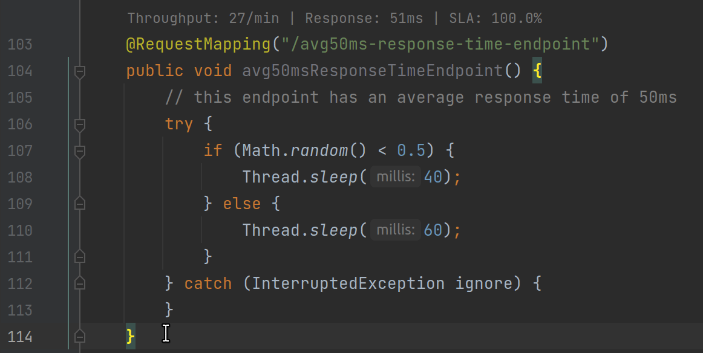

# Quick Stats Indicator

The **Quick Stats Indicator** displays live endpoint metrics for a quick idea of an endpoint's activity. Using this
indicator, developers can quickly assess the status of an endpoint and determine if the endpoint is performing as
expected.

## Configuration

- n/a

## Screencast

