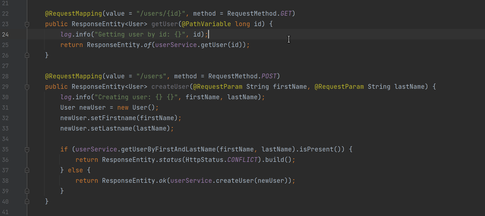

# Quick Stats Indicator

The **Quick Stats Indicator** displays live endpoint metrics for a quick idea of an endpoint's activity. Using this command, developers can quickly assess the status of an endpoint and determine if the endpoint is performing as expected.

todo: diagram with pointers

## Configuration

### Auto-Display

  * **Enabled**: Automatically display the Quick Stats Indicator for all endpoints.
  * **Disabled**: Do not automatically display the Quick Stats Indicator for all endpoints.

### Command

As with other indicators, the **Quick Stats Indicator** can be enabled and disabled for specific contexts via the [Live Command Palette](../../live-commands/live-command-palette.md). Using the <kbd>show quick stats</kbd>/<kbd>hide quick stats</kbd> command developers can quickly display or hide this indicator. These preferences will only affect the current developer and will be persisted across IDE reboots.

#### Screencast

