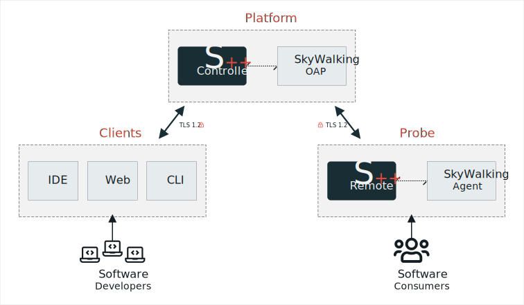

# Introduction

Source++ is a live software development platform built to assist in the debugging and development of actively-running
production software. Source++ works by enhancing your application's code through safe and completely reversible runtime
modifications. These modifications are minuscule and negligible in nature, serving only to emit additional
data which is collected by [Apache SkyWalking](https://skywalking.apache.org), which Source++ is proudly built on top
of.

Source++ aims to move observability to the left, giving developers complete visibility into their software independent
of the environment or deployment type, from monolith to microservices. This is achieved by giving developers the ability
to dynamically capture exceptions, logs, metrics, traces, and other data points, which are traditionally only defined during the
development phase. This allows developers to analyze issues straight from the environments in which they're running.

## Overview

At the highest level, Source++ works by connecting developers via authorized clients to a platform, which is in constant
communication with a number of probes. These probes are in turn integrated with the production applications these developers are
familiar with, and it is through this triadic arrangement that developers can safely interface with live production applications.

!

### Platform

The [Source++ Platform](../implementation/tools/platform/general.md) is the backbone of the Source++ system. It serves
as the gateway for both probes and clients and handles auditing, authentication, and authorization.

### Probe

The [Source++ Probe](../implementation/tools/probe/general.md) uses bytecode-manipulations to add live instruments in real-time, allowing developers to debug live production applications.

### Clients

- [JetBrains Plugin](../implementation/tools/clients/jetbrains-plugin.md)
- [Command Line Interface](../implementation/tools/clients/cli.md)
- [GraphQL](../implementation/tools/clients/graphql.md)

---

#### What's next?

- [Install platform](../installation)
