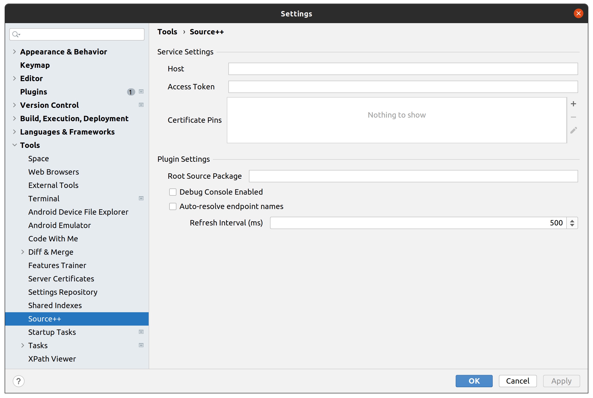

# JetBrains Plugin

- [JetBrains Marketplace](https://plugins.jetbrains.com/plugin/12033-source-)

## Requirements

- [JetBrains IDE](https://www.jetbrains.com)
    - IntelliJ IDEA Community — 2022.1+
    - IntelliJ IDEA Educational — 2022.1+
    - IntelliJ IDEA Ultimate — 2022.1+
    - Android Studio — 2022.1+
  
## Installation

Use the built-in plugin system at:

<kbd>Preferences</kbd> > <kbd>Plugins</kbd> > <kbd>Marketplace</kbd> > <kbd>Search for "Source++"</kbd> > <kbd>Install Plugin</kbd>

## Configuration

The configuration settings can be found at: <kbd>File</kbd> > <kbd>Settings</kbd> > <kbd>Tools</kbd> > <kbd>Source++</kbd>

!

### Service Settings

| Option               | Default | Description                                                     |
|:---------------------|---------|:----------------------------------------------------------------|
| **Host**             |         | Platform host to connect to                                     |
| **Access Token**     |         | Platform port to connect to                                     |
| **Certificate Pins** |         | Optional certificate pins (useful for self-signed certificates) |

### Plugin Settings

| Option                          | Default         | Description                                   |
|:--------------------------------|-----------------|:----------------------------------------------|
| **Root Source Package**         | *\*GENERATED*\* | Base source code package (e.g. `com.example`) |
| **Debug Console Enabled**       | false           | Additional console for plugin debug logs      |
| **Auto-Resolve Endpoint Names** | true            | Automatically resolve endpoint names          |

## Keyboard Shortcuts

#### Open Live Command Prompt

- ++ctrl+shift+s++

#### Show/Hide Live Instruments & Views

- ++ctrl+shift+d++
